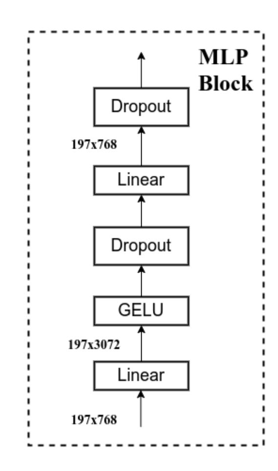
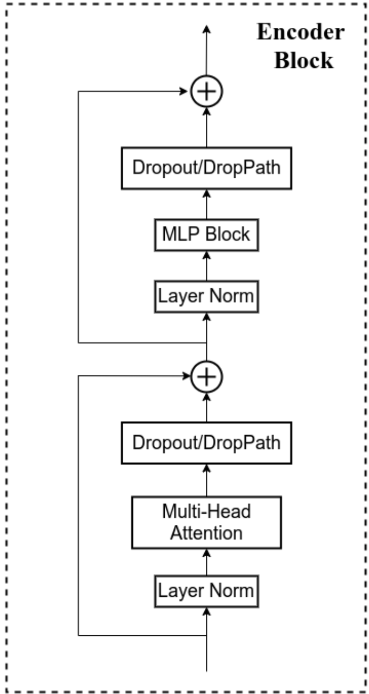
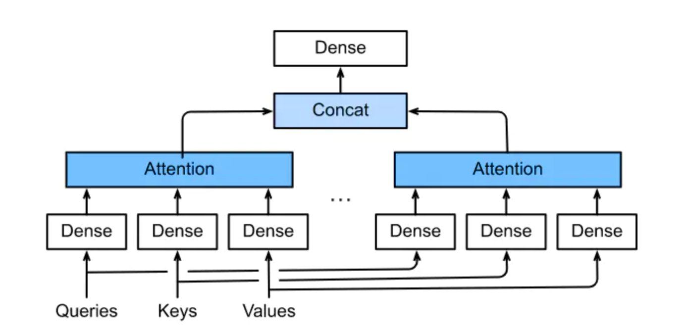
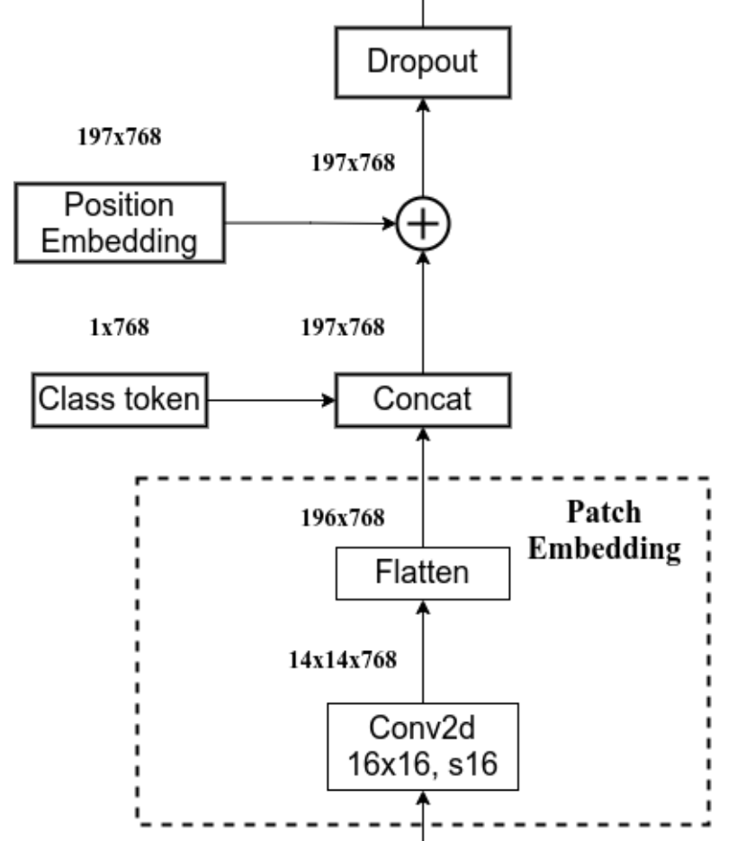
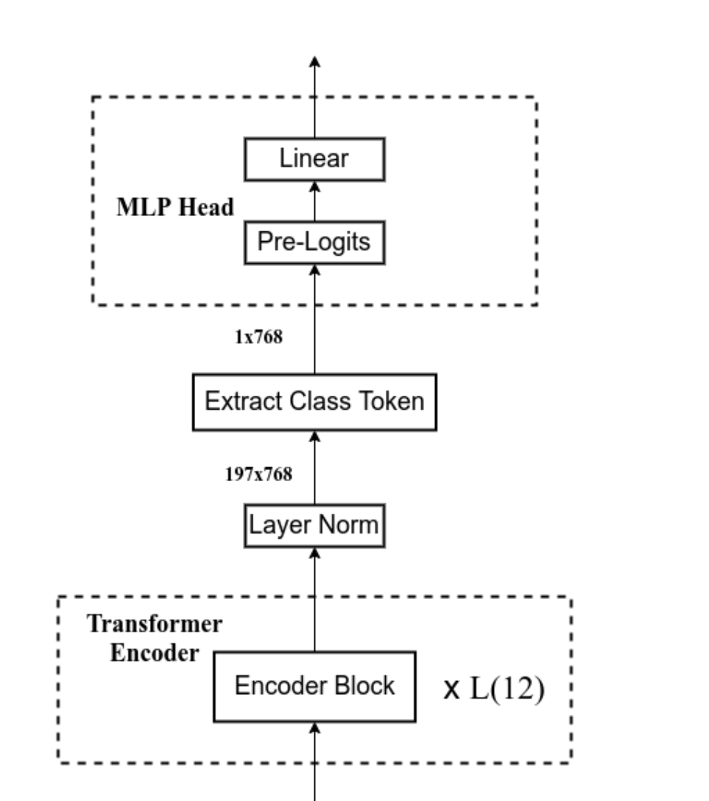

# VIT-CPP


| key           | Value | description                     |
| ------------- | ----- | ------------------------------- |
| FIG_WIDTH     | 224   | 图像宽度                        |
| KERNEL_WIDTH  | 16    | 卷积和大小，for ViT B/16        |
| DIM           | 768   | Embedding的维度 (16x16x3)       |
| DEP           | 196   | 图像patch 数量 ((224/16)^2=196) |
| DIM_HID       | 3072  | MLP_HEAD中隐藏层宽度 (768x4)    |
| HEAD_SIZE     | 8     | MultiHeadAttention中Head的数量  |
| ENC_LAYER_CNT | 12    | Encoder 的层数                  |

请将encode block的预训练参数解压到parameter文件夹下, 保持block+数字的文件夹名字
https://zjuintl-my.sharepoint.com/:u:/g/personal/jiarun_19_intl_zju_edu_cn/ERdxaZSizMZOiB3vWGCqZPIB4ktltAS66PPfnouynf3FSQ?e=Eu9iYv
## MLP Head



```c++
namespace transformer {
    template<typename T, int DIM_IN, int DIM_OUT, int DIM_HID>
    struct MLPParameter {
        LinearParameter<T, DIM_IN, DIM_HID> linear_p1;
        LinearParameter<T, DIM_HID, DIM_OUT> linear_p2;
        T dr;
        MLPParameter() {
            this->dr = 0.1;
        }
        long long count() {
            return linear_p1.count() + linear_p2.count();
        }
    };
    template<typename T, int DIM_IN, int DIM_OUT, int DIM_HID>
    class MLP {
    public:
        static void forward(std::array<T, DIM_IN> &input,
                            std::array<T, DIM_OUT> &output,
                            MLPParameter<T, DIM_IN, DIM_OUT, DIM_HID> &ff_p) {
            auto tmp = std::array<std::array<T, DIM_HID>, 3>{};
            auto tmp2 = std::array<T, DIM_OUT>{};
            Linear<T, DIM_IN, DIM_HID>::forward(input, tmp[0], ff_p.linear_p1);
            Gelu<T, DIM_HID>::forward(tmp[0], tmp[1]);
            Dropout<T, DIM_HID>::forward(tmp[1], tmp[2], ff_p.dr);
            Linear<T, DIM_HID, DIM_OUT>::forward(tmp[2], tmp2, ff_p.linear_p2);
            Dropout<T, DIM_OUT>::forward(tmp2, output, ff_p.dr);
        }
    };
}
```

## Encoder



```c++
namespace transformer {
    template<typename T, int DIM, int DIM_HID, int HEAD_SIZE>
    struct EncoderLayerParameter {
        LayerNormParameter<T, DIM> norm1_p;
        MultiHeadAttentionParameter <T, DIM, HEAD_SIZE> attn_p;
        T dr1;
        LayerNormParameter<T, DIM> norm2_p;
        MLPParameter <T, DIM, DIM, DIM_HID> ff_p;
        T dr2;
        EncoderLayerParameter() {
            dr1 = 0.1;
            dr2 = 0.1;
        }
        long long count() {
            return norm1_p.count() + attn_p.count() + norm2_p.count() + ff_p.count();
        }
    };
    template<typename T, int DIM, int DEP, int DIM_HID, int HEAD_SIZE>
    class EncoderLayer {
    public:
        static void forward(std::array<std::array<T, DIM>, DEP> &input,
                            std::array<std::array<T, DIM>, DEP> &output,
                            EncoderLayerParameter<T, DIM, DIM_HID, HEAD_SIZE> &p) {
            auto tmp = std::array<std::array<std::array<T, DIM>, DEP>, 6>{};
            for (int i = 0; i < DEP; ++i) {
                LayerNorm<T, DIM>::forward(input[i], tmp[0][i], p.norm1_p);
            }
            MultiHeadAttention<T, DIM, DEP, HEAD_SIZE>::forward(tmp[0], tmp[0], tmp[0], tmp[1], p.attn_p);
            for (int i = 0; i < DEP; ++i) {
                Dropout<T, DIM>::forward(tmp[1][i], tmp[2][i], p.dr1);
            }
            for (int i = 0; i < DEP; ++i) {
                for (int j = 0; j < DIM; ++j) {
                    tmp[2][i][j] += input[i][j];
                }
            }
            for (int i = 0; i < DEP; ++i) {
                LayerNorm<T, DIM>::forward(tmp[2][i], tmp[3][i], p.norm2_p);
            }
            for (int i = 0; i < DEP; ++i) {
                MLP<T, DIM, DIM, DIM_HID>::forward(tmp[3][i], tmp[4][i], p.ff_p);
            }
            for (int i = 0; i < DEP; ++i) {
                Dropout<T, DIM>::forward(tmp[4][i], tmp[5][i], p.dr2);
            }
            for (int i = 0; i < DEP; ++i) {
                for (int j = 0; j < DIM; ++j) {
                    output[i][j] = input[i][j] + tmp[5][i][j];
                }
            }
        }
    };

    template<typename T, int DIM, int DIM_HID, int HEAD_SIZE, int LAYER_CNT>
    struct EncoderParameter {
        std::array<EncoderLayerParameter<T, DIM, DIM_HID, HEAD_SIZE>, LAYER_CNT> layers_p;
        LayerNormParameter<T, DIM> norm_p;
        long long count() {
            return layers_p[0].count() * LAYER_CNT + norm_p.count();
        }
    };
    template<typename T, int DIM, int DEP, int DIM_HID, int HEAD_SIZE, int LAYER_CNT>
    class Encoder {
    public:
        static void forward(std::array<std::array<T, DIM>, DEP> &input,
                            std::array<std::array<T, DIM>, DEP> &output,
                            EncoderParameter<T, DIM, DIM_HID, HEAD_SIZE, LAYER_CNT> &p) {
            auto tmp = std::array<std::array<std::array<T, DIM>, DEP>, LAYER_CNT>{};
            for (int i = 0; i < LAYER_CNT; ++i) {
                if (i == 0) {
                    EncoderLayer<T, DIM, DEP, DIM_HID, HEAD_SIZE>::forward(input, tmp[0], p.layers_p[i]);
                } else {
                    EncoderLayer<T, DIM, DEP, DIM_HID, HEAD_SIZE>::forward(tmp[i - 1], tmp[i], p.layers_p[i]);
                }
            }
            for (int i = 0; i < DEP; ++i) {
                LayerNorm<T, DIM>::forward(tmp[LAYER_CNT - 1][i], output[i], p.norm_p);
            }
        }
    };
}

```

## Attention



```c++
namespace transformer {
    template<typename T, int DIM, int HEAD_SIZE>
    struct MultiHeadAttentionParameter {
        LinearParameter <T, DIM, DIM> linear_q_p[HEAD_SIZE], linear_k_p[HEAD_SIZE], linear_v_p[HEAD_SIZE];
        LinearParameter<T, DIM * HEAD_SIZE, DIM> linear_p;
        T dr;
        MultiHeadAttentionParameter() {
            dr = 0.1;
        }
        long long count() {
            return linear_k_p[0].count() * HEAD_SIZE * 3 + linear_p.count();
        }
    };
    template<typename T, int DIM, int DEP, int HEAD_SIZE>
    class MultiHeadAttention {
    public:
        static void forward(std::array<std::array<T, DIM>, DEP> &q_in,
                            std::array<std::array<T, DIM>, DEP> &k_in,
                            std::array<std::array<T, DIM>, DEP> &v_in,
                            std::array<std::array<T, DIM>, DEP> &output,
                            MultiHeadAttentionParameter<T, DIM, HEAD_SIZE> &p) {
            T scale = 1.0 / sqrt((T) DIM * 1.0 / HEAD_SIZE);
            auto q_tmp = std::array<std::array<std::array<T, DIM>, DEP>, HEAD_SIZE>{};
            auto k_tmp = std::array<std::array<std::array<T, DIM>, DEP>, HEAD_SIZE>{};
            auto v_tmp = std::array<std::array<std::array<T, DIM>, DEP>, HEAD_SIZE>{};
            auto q_tmp_2 = std::array<std::array<std::array<T, DIM>, DEP>, HEAD_SIZE>{};

            for (int i = 0; i < HEAD_SIZE; ++i) {
                MultiLinear<T, DIM, DIM, DEP>::forward(q_in, q_tmp[i], p.linear_q_p[i]);
                MultiLinear<T, DIM, DIM, DEP>::forward(k_in, k_tmp[i], p.linear_k_p[i]);
                MultiLinear<T, DIM, DIM, DEP>::forward(v_in, v_tmp[i], p.linear_v_p[i]);
                for (int j = 0; j < DEP; ++j) {
                    Dropout<T, DIM>::forward(q_tmp[i][j], q_tmp_2[i][j], p.dr);
                    for (int k = 0; k < DIM; ++k) {
                        q_tmp_2[i][j][k] *= scale;
                    }
                }
            }
            // Attention(Q, K, V) = softmax(QK^T/sqrt(d_k))V && Concat
            auto nex_tmp = std::array<std::array<std::array<std::array<T, DEP>, DEP>, HEAD_SIZE>, 2>{};
            for (int h = 0; h < HEAD_SIZE; ++h) {
                for (int i = 0; i < DEP; ++i) {
                    for (int j = 0; j < DEP; ++j) {
                        nex_tmp[0][h][i][j] = 0;
                        for (int k = 0; k < DIM; ++k) {
                            nex_tmp[0][h][i][j] += q_tmp_2[h][i][k] * k_tmp[h][j][k];
                        }
                    }
                }
                Softmax<T, DEP, DEP>::forward(nex_tmp[0][h], nex_tmp[1][h]);
            }
            auto f_nex_tmp = std::array<std::array<T, DIM * HEAD_SIZE>, DEP>{};
            for (int h = 0; h < HEAD_SIZE; ++h) {
                for (int i = 0; i < DEP; ++i) {
                    for (int j = 0; j < DIM; ++j) {
                        f_nex_tmp[i][h * HEAD_SIZE + j] = 0;
                        for (int k = 0; k < DEP; ++k) {
                            f_nex_tmp[i][h * HEAD_SIZE + j] += nex_tmp[1][h][i][k] * v_tmp[h][k][j];
                        }
                    }
                }
            }
            MultiLinear<T, DIM * HEAD_SIZE, DIM, DEP>::forward(f_nex_tmp, output, p.linear_p);
        }
    };
}

```


## Patch-Embedding



```C++

namespace transformer {
    template<typename T, int KERNEL_WIDTH, int OUT_CH> //OUT_CH = DIM
    struct Conv2dParameter{
        std::array<std::array<std::array<T, KERNEL_WIDTH>, KERNEL_WIDTH>, OUT_CH> weights;
        long long count(){
            long long ret = 0;
            ret += KERNEL_WIDTH * KERNEL_WIDTH * OUT_CH;
            return ret;
        }
        T dr;
        Conv2dParameter() {
            this->dr = 0.1;
        }
    };
    template<typename T, int KERNEL_WIDTH, int FIG_WIDTH, int OUT_WIDTH, int IN_CH, int OUT_CH, int DEP> //outwidth = fig_width/KERNEL_WIDTH
    class Conv2d{
    public:
        static void forward(std::array<std::array<std::array<T, FIG_WIDTH>, FIG_WIDTH>, IN_CH> &input,
                            std::array<std::array<T, OUT_CH>, DEP+1> &output, //for class token add 1
                            std::array<T, OUT_CH> &class_token,
                            std::array<std::array<T, OUT_CH>, DEP+1> &position_embed,
                            Conv2dParameter<T, KERNEL_WIDTH, OUT_CH> &p) {
            auto temp = std::array<std::array<std::array<T, OUT_WIDTH>, OUT_WIDTH>, OUT_CH>{};
            auto tmp2 = std::array<std::array<T, OUT_CH>, DEP+1>{};
            for (int i = 0; i < OUT_WIDTH; i++ )
                for (int j = 0; j < OUT_WIDTH; j++)
                    for (int out_ch = 0; out_ch < OUT_CH; out_ch++) {
                        int tmp = 0;
                        for (int m = 0; m < KERNEL_WIDTH; m++)
                            for (int n = 0; n < KERNEL_WIDTH; n++)
                                for (int in_ch = 0; in_ch < IN_CH; in_ch ++) {
                                    if ((i*KERNEL_WIDTH+m)>=0 && (i*KERNEL_WIDTH-m)<FIG_WIDTH && (j*KERNEL_WIDTH-n)>=0 && (j*KERNEL_WIDTH-n)<FIG_WIDTH) {
                                        tmp += p.weights[OUT_CH][m][n] * input[in_ch][i*KERNEL_WIDTH+m][j*KERNEL_WIDTH+n];
                                    }
                                }
                        temp[out_ch][i][j] = tmp;
                    }
            //flatten the data
            for (int out_ch = 0; out_ch < OUT_CH; out_ch++) { //out_ch = dim
                for (int i = 0; i < OUT_WIDTH; i++)
                    for (int j = 0; j < OUT_WIDTH; j++)
                tmp2[i*OUT_WIDTH+j][out_ch] = temp[out_ch][i][j]; //output[dep][dim]
            }
            //add class token
            for (int out_ch = 0; out_ch < OUT_CH; out_ch++) {
                    tmp2[DEP][out_ch] = class_token[out_ch];
            }
            //add position embedding
            for (int i = 0; i < DEP+1; i++)
                for(int out_ch = 0; out_ch < OUT_CH; out_ch++) {
                    tmp2[i][out_ch] += position_embed[i][out_ch];
                }
            //dropput
            for (int i = 0; i < DEP+1; i++) {
                Dropout<T, OUT_CH>::forward(tmp2[i], output[i], p.dr);
            }
        }
    };
}

```

## MLP Head



```C++
namespace transformer {
    template<typename T, int DIM, int N_CLASS>
    struct MLPHEADParameter {
        LayerNormParameter<T, DIM> norm1_p;
        LinearParameter<T, DIM, N_CLASS> linear_p1;
        long long count() {
            return linear_p1.count();
        }
    };
    template<typename T, int DIM, int DEP, int N_CLASS>
    class MLP_HEAD{
    public:
        static void forward(std::array<std::array<T, DIM>, DEP> &input,
                            std::array<T, N_CLASS> &output,
                            MLPHEADParameter<T,DIM, N_CLASS> &p){
            auto tmp = std::array<std::array<T, DIM>, DEP>{};
            for (int i = 0; i < DEP; ++i){
                LayerNorm<T, DIM>::forward(input[i], tmp[i], p.norm1_p);
            }
            Linear<T, DIM, N_CLASS>::forward(tmp[DEP], output, p.linear_p1); //linear for class token
        }
    };
}

```

